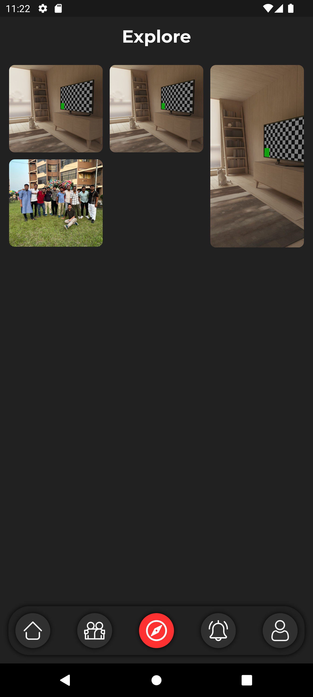

# Socialseed

```Final Year Project```

## 📋 Index
- 📖 Overview
- 👥 Developer Team
- 📷 Snapshots
- ✨ Features
- </> Project Structure
- 🚀 Branches
- 🔄 Sequence
- ⚙️ Getting Started

## 📖 Overview
Socialseed is a dynamic social media platform designed with a wide range of features to enhance user interaction and connectivity. From basic functionalities like posting content to advanced features like AI-generated captions and chat integration, Socialseed aims to provide a comprehensive social experience.

## 👥 Developer Team


- **Kuntal Gain** (Team Lead)
- **Abhisekh Rajak** (Adaptive UI & Animations)
- **Rupam Das** (Privacy & Securities)
- **Aisha Halder** (AI Integration)

<!------------------------ ### Contributors ------------------------------->


## 📷 Snapshots

<div style="display: flex; flex-wrap: wrap;"> 
    
    
     
     
     
     
</div>

## ✨ Features

### Core Features:
- Post Image/Video/Text
- Add Friend / Send Request
- Push Notifications
- Friend Suggestions
- Public/Private Group Creation (later)
- Pages and Events Management (later)
- User Profile and Saved Content
- Post Stories
- Featured Content (later)

### Unique Features:
- **AI Generated Captions for Posts**
- **Auto-Trimmed Videos**
- **Personalized Tag System** (Home, College, School, Work) for Friend Requests/Suggestions
- **Archived Posts**
- **Chat Integration** (E2E encryption)
- **Milestone Badges** (10, 50, 100, ...)
- **Privacy & Security Measures**

## Project Structure

```
lib
    ├── app
    │   ├── cubits
    │   │   ├── archivepost
    │   │   │   ├── archivepost_cubit.dart
    │   │   │   └── archivepost_state.dart
    │   │   ├── auth
    │   │   │   ├── auth_cubit.dart
    │   │   │   └── auth_state.dart
    │   │   ├── comment
    │   │   │   └── cubit
    │   │   │   │   ├── comment_cubit.dart
    │   │   │   │   └── comment_state.dart
    │   │   ├── credential
    │   │   │   ├── credential_cubit.dart
    │   │   │   └── credential_state.dart
    │   │   ├── get_single_other_user
    │   │   │   ├── get_single_other_user_cubit.dart
    │   │   │   └── get_single_other_user_state.dart
    │   │   ├── get_single_post
    │   │   │   └── cubit
    │   │   │   │   ├── get_single_post_cubit.dart
    │   │   │   │   └── get_single_post_state.dart
    │   │   ├── get_single_user
    │   │   │   ├── get_single_user_cubit.dart
    │   │   │   └── get_single_user_state.dart
    │   │   ├── message
    │   │   │   ├── chat_id
    │   │   │   │   ├── chat_cubit.dart
    │   │   │   │   └── chat_state.dart
    │   │   │   ├── message_cubit.dart
    │   │   │   └── message_state.dart
    │   │   ├── post
    │   │   │   ├── post_cubit.dart
    │   │   │   └── post_state.dart
    │   │   ├── savedcontent
    │   │   │   ├── savedcontent_cubit.dart
    │   │   │   └── savedcontent_state.dart
    │   │   ├── story
    │   │   │   ├── story_cubit.dart
    │   │   │   └── story_state.dart
    │   │   └── users
    │   │   │   ├── user_cubit.dart
    │   │   │   └── user_state.dart
    │   ├── screens
    │   │   ├── chat
    │   │   │   ├── chat_screen.dart
    │   │   │   └── message_screen.dart
    │   │   ├── credential
    │   │   │   ├── forgot_screen.dart
    │   │   │   ├── signin_screen.dart
    │   │   │   └── signup_screen.dart
    │   │   ├── friend
    │   │   │   ├── friend_suggestion_screen.dart
    │   │   │   └── search_screen.dart
    │   │   ├── home_screen.dart
    │   │   ├── no_internet.dart
    │   │   ├── notification
    │   │   │   └── notification_screen.dart
    │   │   ├── post
    │   │   │   ├── edit_post_screen.dart
    │   │   │   ├── explore_page.dart
    │   │   │   ├── feed_screen.dart
    │   │   │   ├── location_screen.dart
    │   │   │   ├── post_screen.dart
    │   │   │   ├── post_story_screen.dart
    │   │   │   ├── story_screen.dart
    │   │   │   ├── story_ui.dart
    │   │   │   ├── tags_screen.dart
    │   │   │   ├── video_post_screen.dart
    │   │   │   └── view_post_screen.dart
    │   │   ├── settings
    │   │   │   ├── about_screen.dart
    │   │   │   ├── account_privacy_screen.dart
    │   │   │   ├── archived_content.dart
    │   │   │   ├── edit_profile_screen.dart
    │   │   │   ├── saved_posts_screen.dart
    │   │   │   ├── settings_screen.dart
    │   │   │   └── verification_screen.dart
    │   │   └── user
    │   │   │   ├── follower_list_screen.dart
    │   │   │   ├── friend_list_screen.dart
    │   │   │   ├── milestone_screen.dart
    │   │   │   ├── single_profile_screen.dart
    │   │   │   └── user_profile.dart
    │   └── widgets
    │   │   ├── comment_card_widget.dart
    │   │   ├── image_card.dart
    │   │   ├── image_tile_widget.dart
    │   │   ├── message_card_widget.dart
    │   │   ├── message_tile_widget.dart
    │   │   ├── more_menu_items.dart
    │   │   ├── notification_widget.dart
    │   │   ├── opacity_leaf_animation.dart
    │   │   ├── post_widget.dart
    │   │   ├── profile_widget.dart
    │   │   ├── search_widget.dart
    │   │   ├── story_card_widget.dart
    │   │   ├── text_field_widget.dart
    │   │   ├── vid_player_widget.dart
    │   │   ├── video_card.dart
    │   │   ├── view_post_card.dart
    │   │   └── view_post_widget.dart
    ├── data
    │   ├── data_source
    │   │   ├── remote_datasource.dart
    │   │   └── remote_datasource_impl.dart
    │   ├── models
    │   │   ├── chat_model.dart
    │   │   ├── comment_model.dart
    │   │   ├── map_model.dart
    │   │   ├── message_model.dart
    │   │   ├── post_model.dart
    │   │   ├── story_model.dart
    │   │   └── user_model.dart
    │   └── repos
    │   │   └── firebase_repository_impl.dart
    ├── dependency_injection.dart
    ├── domain
    │   ├── entities
    │   │   ├── chat_entity.dart
    │   │   ├── comment_entity.dart
    │   │   ├── message_entity.dart
    │   │   ├── post_entity.dart
    │   │   ├── story_entity.dart
    │   │   └── user_entity.dart
    │   ├── repos
    │   │   └── firebase_repository.dart
    │   └── usecases
    │   │   ├── chat
    │   │       ├── create_messageid_usecase.dart
    │   │       ├── fetch_conversations_usecase.dart
    │   │       ├── fetch_message_usecase.dart
    │   │       ├── is_messageid_exists_usecase.dart
    │   │       └── send_message_usecase.dart
    │   │   ├── comment
    │   │       ├── create_comment_usecase.dart
    │   │       ├── delete_comment_usecase.dart
    │   │       ├── fetch_comment_usecase.dart
    │   │       ├── like_comment_usecase.dart
    │   │       └── update_comment_usecase.dart
    │   │   ├── creds
    │   │       ├── forget_password_usecase.dart
    │   │       ├── is_signin_usecase.dart
    │   │       ├── sign_in_usecase.dart
    │   │       ├── sign_out_usecase.dart
    │   │       └── sign_up_usecase.dart
    │   │   ├── post
    │   │       ├── create_post_usecase.dart
    │   │       ├── delete_post_usecase.dart
    │   │       ├── fetch_post_usecase.dart
    │   │       ├── fetch_single_post_by_uid_usecase.dart
    │   │       ├── fetch_single_post_usecase.dart
    │   │       ├── like_post_usecase.dart
    │   │       └── update_post_usecase.dart
    │   │   ├── story
    │   │       ├── add_story_usecase.dart
    │   │       ├── fetch_story_usecase.dart
    │   │       └── view_story_usecase.dart
    │   │   ├── user
    │   │       ├── archieve_post_usecase.dart
    │   │       ├── create_user_usecase.dart
    │   │       ├── fetch_archieved_posts.dart
    │   │       ├── fetch_saved_content_usecase.dart
    │   │       ├── get_current_uid_usecase.dart
    │   │       ├── get_single_other_user_usecase.dart
    │   │       ├── get_single_user_usecase.dart
    │   │       ├── get_user_usecase.dart
    │   │       ├── save_post_usecase.dart
    │   │       ├── update_user_status_usecase.dart
    │   │       └── update_user_usecase.dart
    │   │   └── user_controllers
    │   │       ├── accept_request_usecase.dart
    │   │       ├── follow_user_usecase.dart
    │   │       ├── reject_request_usecase.dart
    │   │       ├── send_request_usecase.dart
    │   │       └── unfollow_user_usecase.dart
    ├── features
    │   ├── api
    │   │   └── generate_caption.dart
    │   └── services
    │   │   ├── map_service.dart
    │   │   └── story_service.dart
    ├── firebase_options.dart
    ├── main.dart
    └── utils
    │   ├── constants
    │       ├── asset_const.dart
    │       ├── color_const.dart
    │       ├── constants.dart
    │       ├── firebase_const.dart
    │       ├── ongenerate_routes.dart
    │       ├── page_const.dart
    │       ├── tags_const.dart
    │       └── text_const.dart
    │   └── custom
    │       ├── custom_snackbar.dart
    │       ├── custom_widgets.dart
    │       └── shimmer_effect.dart
```

## 🚀 Branches

- **Main Branch (master):** This branch represents the `production-ready` code. It should only contain stable and tested code. The app is deployed from this branch.
  
- **Develop Branch:** This branch is where all the `development` work takes place. It contains the latest features and changes being worked on by the team.

- **Feature Branches:** For each new `feature` or task, a feature branch is created from the develop branch. The feature is developed in this branch, and once completed and tested, it's merged back into the develop branch.

- **Release Branches:** When preparing for a new `release`, a release branch is created from the develop branch. This allows code stabilization for the upcoming release without introducing new features.

- **Hotfix Branches:** If a `critical` issue arises in production, a hotfix branch is created from the main branch to fix the issue. The fix is then merged back into both the main and develop branches.

## 🔄 Sequence

- `Feature` -> `Develop` (***Only Developers***)
- `Develop` -> `Release` (***Team Leader***)
- `Release` -> `Production` (***Team Leader***)
- `Production` -> `HotFix` (Optional)

## ⚙️ Getting Started

1. **Fork** the Feature Branch.

2. **Clone** the repository:
   ```bash
   git clone https://github.com/{@YourGitHubUserID}/Socialseed.git
   ```


