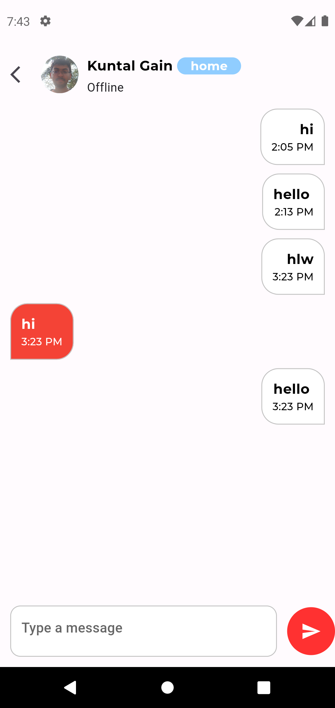
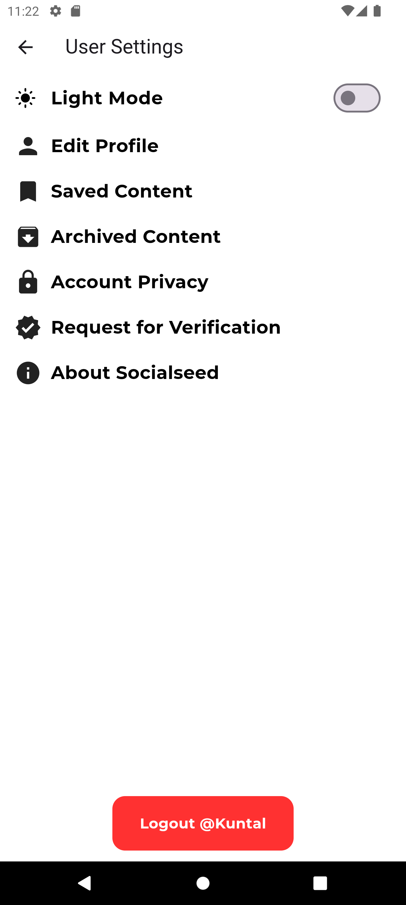

# Socialseed

```Final Year Project```

## 📋 Index
- 📖 Overview
- 👥 Developer Team
- 📷 Snapshots
- ✨ Features
- 🚀 Branches
- 🔄 Sequence
- ⚙️ Getting Started

## 📖 Overview
Socialseed is a dynamic social media platform designed with a wide range of features to enhance user interaction and connectivity. From basic functionalities like posting content to advanced features like AI-generated captions and chat integration, Socialseed aims to provide a comprehensive social experience.

## 👥 Developer Team


- **Kuntal Gain** (Team Lead)
- **Abhisekh Rajak** (Adaptive UI & Animations)
- **Rupam Das** (Privacy & Securities)
- **Aisha Halder** (AI Integration)

<!------------------------ ### Contributors ------------------------------->

<!------------------------  ------------------------------->

## 📷 Snapshots

<div style="display: flex; flex-wrap: wrap;"> 
    
    
     
     
     
     
</div>

## ✨ Features

### Core Features:
- Post Image/Video/Text
- Add Friend / Send Request
- Push Notifications
- Friend Suggestions
- Public/Private Group Creation (later)
- Pages and Events Management (later)
- User Profile and Saved Content
- Post Stories
- Featured Content (later)

### Unique Features:
- **AI Generated Captions for Posts**
- **Auto-Trimmed Videos**
- **Personalized Tag System** (Home, College, School, Work) for Friend Requests/Suggestions
- **Archived Posts**
- **Chat Integration** (E2E encryption)
- **Milestone Badges** (10, 50, 100, ...)
- **Privacy & Security Measures**

## 🚀 Branches

- **Main Branch (master):** This branch represents the `production-ready` code. It should only contain stable and tested code. The app is deployed from this branch.
  
- **Develop Branch:** This branch is where all the `development` work takes place. It contains the latest features and changes being worked on by the team.

- **Feature Branches:** For each new `feature` or task, a feature branch is created from the develop branch. The feature is developed in this branch, and once completed and tested, it's merged back into the develop branch.

- **Release Branches:** When preparing for a new `release`, a release branch is created from the develop branch. This allows code stabilization for the upcoming release without introducing new features.

- **Hotfix Branches:** If a `critical` issue arises in production, a hotfix branch is created from the main branch to fix the issue. The fix is then merged back into both the main and develop branches.

## 🔄 Sequence

- `Feature` -> `Develop` (***Only Developers***)
- `Develop` -> `Release` (***Team Leader***)
- `Release` -> `Production` (***Team Leader***)
- `Production` -> `HotFix` (Optional)

## ⚙️ Getting Started

1. **Fork** the Feature Branch.

2. **Clone** the repository:
   ```bash
   git clone https://github.com/{@YourGitHubUserID}/Socialseed.git
   ```


